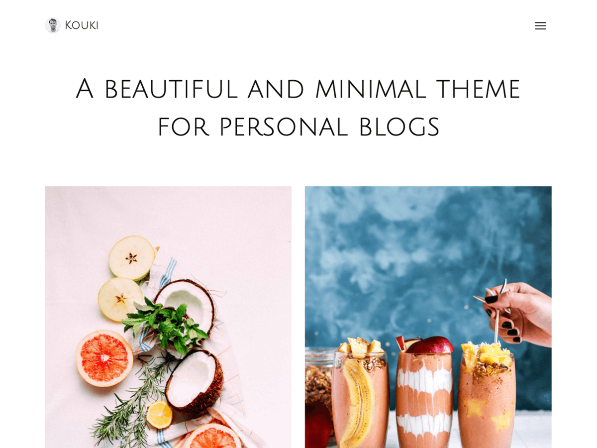

# Kouki - A beautiful and minimal theme for personal blogs

Kouki is meant for publishers who like to display their content in a delightful and minimal way. Ideal for food blogs, photographers, minimalists, tumble logs and everyone else who likes an unobstrusive WordPress theme. Non-mandatory theme options help you to individualize the theme to your needs. Change colors, choose fonts from the Google libary and add social icons. The theme is responsive and looks good on small devices.

[Live Demo](https://kouki.felixdorner.de) / [Download Theme](https://wordpress.org/themes/kouki/)

## Support

As this is a free theme, support is limited to the basics. You can find me helping out in the designated [support forum](https://wordpress.org/support/theme/kouki).

## Contributing

**Found a bug? Please report the issue [here](https://github.com/felixdorner/kouki/issues)!** Want to contribute a patch or create a new feature? Just send me a pull request and I will review it.

Would you like to translate Kouki in to your language? Get involved [here](https://translate.wordpress.org/projects/wp-themes/kouki) and help to make this theme even more accessible.

## Author

**Felix Dorner**  
*Design and development*

- [Website](https://felixdorner.de)
- [Twitter](https://twitter.com/felixdorner)
- [Dribbble](https://www.dribbble.com/felixdorner)
